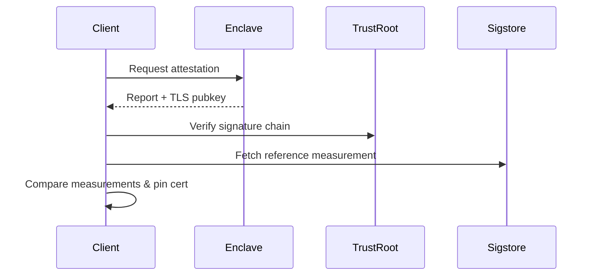

# Tinfoil Verifier

Portable remote-attestation verifier & secure HTTP client for enclave-backed services.

[](https://github.com/tinfoilsh/verifier/actions)

## Overview
Tinfoil Verifier is a Go library that verifies the integrity of remote enclaves (AMD SEV-SNP & Intel TDX) and binds that verification to TLS connections. It also ships a drop-in secure `http.Client` that performs attestation transparently.

## Features
- **Hardware-rooted remote attestation** for AMD SEV-SNP & Intel TDX
- **Self-contained** with no external attestation service
- **Secure HTTP client** with automatic TLS certificate pinning
- **Sigstore integration** for code provenance verification
- **Attested HPKE public keys** for use with [EHBP](https://docs.tinfoil.sh/resources/ehbp) clients
- **WASM build** for browser/Node.js environments
- **Swift bindings** via gomobile for iOS/macOS integration  

## Installation
```bash
go get github.com/tinfoilsh/verifier@latest
```

> **Note**  Until `go-sev-guest` upstreams a required feature, add the temporary replace directive:
> ```bash
> go mod edit -replace github.com/google/go-sev-guest=github.com/tinfoilsh/go-sev-guest@v0.0.0-20250704193550-c725e6216008
> ```

## Quick Start
```go
import "github.com/tinfoilsh/verifier/client"

// 1. Create a client
tinfoilClient := client.NewSecureClient("enclave.example.com", "org/repo")

// 2. Perform HTTP requests – attestation happens automatically
resp, err := tinfoilClient.Get("/api/data", nil)
if err != nil {
    log.Fatal(err)
}
log.Printf("Status: %s, Body: %s", resp.Status, resp.Body)
```

To verify manually and expose the verification state:
```go
groundTruth, err := tinfoilClient.Verify()
if err != nil {
    log.Fatal(err)
}
// Access verified measurements and keys
log.Printf("TLS Cert Fingerprint: %s", groundTruth.TLSPublicKey)
log.Printf("HPKE Public Key: %s", groundTruth.HPKEPublicKey)
```

## Secure HTTP Client
The `client` package wraps `net/http` and adds:
1. **Attestation gate** – the first request verifies the enclave.
2. **TLS pinning** – the enclave-generated certificate fingerprint is pinned for the session.
3. **Round-tripping helpers** – convenience `Get`, `Post` methods.

```go
headers := map[string]string{"Content-Type": "application/json"}
body    := []byte(`{"key": "value"}`)

resp, err := tinfoilClient.Post("/api/submit", headers, body)
```

For advanced usage retrieve the underlying `*http.Client`:
```go
httpClient, err := tinfoilClient.HTTPClient()
```

## Remote Attestation
Tinfoil Verifier currently supports two platforms:

| Platform       | Technique                                | Docs                                                  |
|----------------|------------------------------------------|-------------------------------------------------------|
| **AMD SEV-SNP**| VCEK certificates & SNP report validation | [AMD Spec](https://www.amd.com/en/developer/sev.html)  |
| **Intel TDX** | TDX quote validation & TD report checks   | [Intel Guide](https://www.intel.com/content/www/us/en/developer/tools/trust-domain-extensions/overview.html) |

### Verification Flow



## JavaScript / TypeScript / WASM

### JavaScript / TypeScript SDK

For production JavaScript/TypeScript applications, use the [tinfoil-node](https://github.com/tinfoilsh/tinfoil-node) package, which provides:
- OpenAI-compatible API with built-in verification
- WASM-based verifier integration (uses this repo's WASM build)
- EHBP (Encrypted HTTP Body Protocol) for end-to-end encryption
- Support for browsers, Node.js 20+, Deno, Bun, and Cloudflare Workers
- Comprehensive verification reporting with step-by-step diagnostics

```bash
npm install @tinfoilsh/tinfoil-node
```

See the [tinfoil-node documentation](https://github.com/tinfoilsh/tinfoil-node) for usage examples.

### Direct WASM Usage

For advanced custom integrations, you can use the WASM verifier directly. Built from the same Go source code, it's compiled to WebAssembly to run natively in browsers without requiring server-side verification.

When new versions are tagged, our GitHub Actions workflow automatically:
1. Compiles the Go verification logic to WebAssembly
2. Generates versioned WASM files with integrity guarantees
3. Deploys them to GitHub Pages for secure, cached distribution
4. Updates version tags so clients always load the correct module


### Quick Start

The WASM verifier is hosted at:
```
https://tinfoilsh.github.io/verifier/tinfoil-verifier.wasm
```

Include the Go WASM runtime and load the verifier:

```html
<script src="wasm_exec.js"></script>

<script>
// Load the WASM verifier
const go = new Go();
WebAssembly.instantiateStreaming(
  fetch("https://tinfoilsh.github.io/verifier/tinfoil-verifier.wasm"),
  go.importObject
).then((result) => {
  go.run(result.instance);

  // Complete end-to-end verification (recommended)
  verify("inference.example.com", "tinfoilsh/confidential-llama-qwen")
    .then(groundTruthJSON => {
      const groundTruth = JSON.parse(groundTruthJSON);
      console.log("TLS Cert Fingerprint:", groundTruth.tls_public_key);
      console.log("HPKE Public Key:", groundTruth.hpke_public_key);
      console.log("Verification successful!");
    })
    .catch(error => {
      console.error("Verification failed:", error);
    });
});
</script>
```

### Complete Verification (Recommended)

Use the `verify()` function for complete end-to-end verification that performs all steps atomically:

```javascript
// Complete end-to-end verification
const groundTruthJSON = await verify("inference.example.com", "tinfoilsh/confidential-llama-qwen");
const groundTruth = JSON.parse(groundTruthJSON);

// The ground truth contains:
// - tls_public_key: TLS certificate public key fingerprint (for pinning)
// - hpke_public_key: HPKE public key (for EHBP encryption)
// - digest: GitHub release digest
// - code_measurement: Expected code measurement from GitHub
// - enclave_measurement: Actual runtime measurement from enclave
// - hardware_measurement: TDX platform measurements (if applicable)
// - code_fingerprint: Fingerprint of code measurement
// - enclave_fingerprint: Fingerprint of enclave measurement

console.log("TLS Cert Fingerprint:", groundTruth.tls_public_key);
console.log("HPKE Public Key:", groundTruth.hpke_public_key);
console.log("Verification successful - measurements match!");
```

The `verify()` function automatically:
1. Fetches the latest release digest from GitHub
2. Verifies code provenance using Sigstore/Rekor
3. Performs runtime attestation against the enclave
4. Verifies hardware measurements (for TDX platforms)
5. Compares code and runtime measurements using platform-specific logic

If any step fails, an error is thrown with details about which step failed.

### Manual Step-by-Step Verification

For more control, you can perform individual verification steps:

```javascript
try {
  // 1. Verify enclave attestation
  const enclaveResult = await verifyEnclave("inference.example.com");
  console.log("TLS Cert Fingerprint:", enclaveResult.tls_public_key);
  console.log("HPKE Public Key:", enclaveResult.hpke_public_key);

  // Note: measurement is a JSON string that needs parsing
  const enclaveMeasurement = JSON.parse(enclaveResult.measurement);
  console.log("Enclave measurement:", enclaveMeasurement);

  // 2. Verify code matches GitHub release
  const repo = "tinfoilsh/confidential-llama-qwen";
  const digest = "sha256:abc123...";
  const codeMeasurementJSON = await verifyCode(repo, digest);
  const codeMeasurement = JSON.parse(codeMeasurementJSON);
  console.log("Code measurement:", codeMeasurement);

  // 3. For automatic comparison with platform-specific logic, use verify() instead
  // Manual comparison requires understanding SEV-SNP vs TDX measurement formats
} catch (error) {
  console.error("Verification failed:", error);
}
```

**Recommended**: Use the complete `verify()` function instead of manual steps, as it handles platform-specific measurement comparison automatically.

## Auditing Guide
1. **Certificate chain** – see [`/attestation/genoa_cert_chain.pem`](attestation/genoa_cert_chain.pem)
2. **Attestation logic** – start with [`/attestation/attestation.go`](attestation/attestation.go) and platform files:
   - [`/attestation/sev.go`](attestation/sev.go)
   - [`/attestation/tdx.go`](attestation/tdx.go)
3. **Measurement matching** – inspect [`/sigstore/sigstore.go`](sigstore/sigstore.go)

## Reporting Vulnerabilities

Please report security vulnerabilities by either:

- Emailing [security@tinfoil.sh](mailto:security@tinfoil.sh)

- Opening an issue on GitHub on this repository

We aim to respond to (legitimate) security reports within 24 hours.
