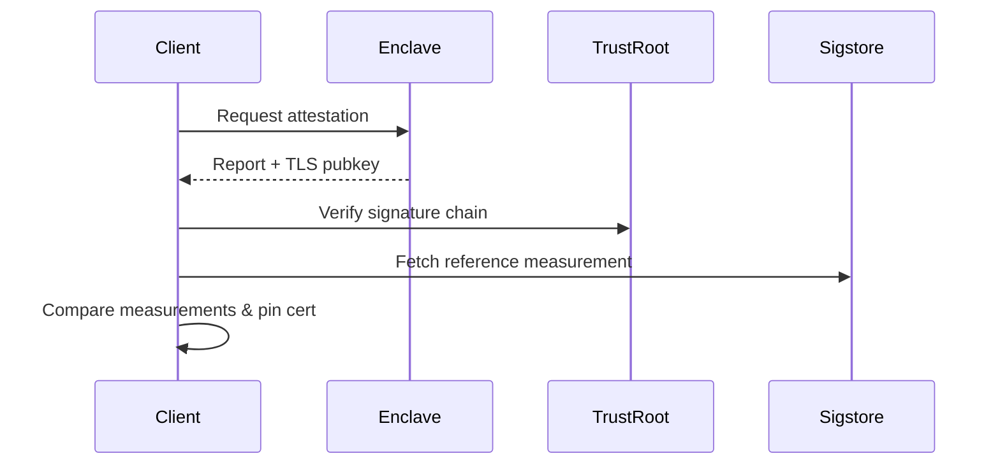

# Tinfoil Verifier

Portable remote-attestation verifier & secure HTTP client for enclave-backed services.

[](https://github.com/tinfoilsh/verifier/actions)

## Overview
Tinfoil Verifier is a Go library that verifies the integrity of remote enclaves (AMD SEV-SNP & Intel TDX) and binds that verification to TLS connections. It also ships a drop-in secure `http.Client` that performs attestation transparently.

## Features
- 🔒 **Hardware-rooted remote attestation** for SEV-SNP & TDX  
- 📦 **Self-contained** with no external attestation service
- 🕸 **Secure HTTP client** with automatic certificate pinning  
- 🛡 **Sigstore integration** for reference measurements  
- 🧑‍💻 **WASM build** for browser/nodejs  

## Installation
```bash
go get github.com/tinfoilsh/verifier@latest
```

> **Note**  Until `go-sev-guest` upstreams a required feature, add the temporary replace directive:
> ```bash
> go mod edit -replace github.com/google/go-sev-guest=github.com/tinfoilsh/go-sev-guest@v0.0.0-20250704193550-c725e6216008
> ```

## Quick Start
```go
import "github.com/tinfoilsh/verifier/client"

// 1. Create a client for your enclave + GitHub repo
tinfoilClient := client.NewSecureClient(
    "enclave.example.com", // Hostname of the enclave
    "org/repo",            // Repository containing attestation bundle
)

// 2. Perform HTTP requests – attestation happens automatically
resp, err := tinfoilClient.Get("/api/data", nil)
if err != nil {
    log.Fatalf("request failed: %v", err)
}
```

To verify manually and expose the verification state:
```go
state, err := tinfoilClient.Verify() // ↳ returns *client.State with details
```

## Secure HTTP Client
The `client` package wraps `net/http` and adds:
1. **Attestation gate** – the first request verifies the enclave.
2. **TLS pinning** – the enclave-generated certificate fingerprint is pinned for the session.
3. **Round-tripping helpers** – convenience `Get`, `Post`, and generic `Do` methods.

```go
headers := map[string]string{"Content-Type": "application/json"}
body    := []byte(`{"key": "value"}`)

resp, err := cli.Post("/api/submit", headers, body)
```

For advanced usage retrieve the underlying `*http.Client`:
```go
httpClient, err := tinfoilClient.HTTPClient()
```

## Remote Attestation
Tinfoil Verifier currently supports two platforms:

| Platform       | Technique                                | Docs                                                  |
|----------------|------------------------------------------|-------------------------------------------------------|
| **AMD SEV-SNP**| VCEK certificates & SNP report validation | [AMD Spec](https://www.amd.com/en/developer/sev.html)  |
| **Intel TDX** | TDX quote validation & TD report checks   | [Intel Guide](https://www.intel.com/content/www/us/en/developer/tools/trust-domain-extensions/overview.html) |

### Verification Flow



## JavaScript / WASM
The same verifier is compiled to **WebAssembly** and published as [`verifier-js`](https://github.com/tinfoilsh/verifier-js) for use in browser or Node.js.


## Auditing Guide
1. **Certificate chain** – see [`/attestation/genoa_cert_chain.pem`](attestation/genoa_cert_chain.pem)
2. **Attestation logic** – start with [`/attestation/attestation.go`](attestation/attestation.go) and platform files:
   - [`/attestation/sev.go`](attestation/sev.go)
   - [`/attestation/tdx.go`](attestation/tdx.go)
3. **Measurement matching** – inspect [`/sigstore/sigstore.go`](sigstore/sigstore.go)

## Reporting Vulnerabilities

Please report security vulnerabilities by emailing [contact@tinfoil.sh](mailto:contact@tinfoil.sh)

We aim to respond to security reports within 24 hours and will keep you updated on our progress.
