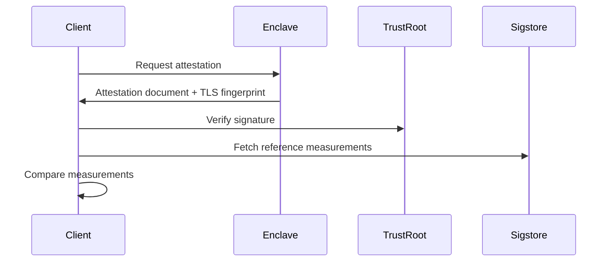

# Tinfoil Verifier

Tinfoil's client-side portable remote attestation verifier.

[](https://github.com/tinfoilsh/verifier/actions)

See [the Tinfoil Go client](http://github.com/tinfoilsh/tinfoil-go) for usage examples. 

## Code Organization

| **Directory**                    |                                                                |
| :------------------------------- | :------------------------------------------------------------- |
| [attestation/](attestation/)     | Implementation of remote attestation verification for SEV and Nitro enclaves. |
| [client/](client/)               | Implementation of secure HTTP client with attestation verification. |
| [sigstore/](sigstore/)           | Integration with Sigstore for verifying measurements against signed attestations. |
| [github/](github/)               | GitHub API integration for fetching release information and attestation bundles. |
| [config/](config/)               | Configuration management for version constraints and settings. |
| [util/](util/)                   | Utility functions including HTTP fetching for both WASM and non-WASM builds. |

## Remote Attestation

Remote attestation provides cryptographic proof that an enclave is running unmodified code in a secure environment. The verifier supports attestation for **AMD SEV-SNP** and **AWS Nitro Enclaves**.

### Example Usage

```go
// 1. Fetch and verify attestation from an enclave
doc, certFingerprint, err := attestation.Fetch("enclave.example.com")
if err != nil {
    return fmt.Errorf("failed to fetch attestation: %w", err)
}

// 2. Verify the attestation's authenticity
measurements, userData, err := doc.Verify()
if err != nil {
    return fmt.Errorf("attestation verification failed: %w", err)
}

// 3. Check measurements against known good values from Sigstore
trustRoot, err := sigstore.FetchTrustRoot()
if err != nil {
    return fmt.Errorf("failed to fetch trust root: %w", err)
}

measurement, err := sigstore.VerifyAttestation(
    trustRoot,
    attestationBundle, // Need to fetch this from GitHub
    hexDigest,        // Need to fetch this from GitHub
    "org/repo"
)
if err != nil {
    return fmt.Errorf("attestation verification failed: %w", err)
}
```

> **Remark:** The certificate fingerprint binds the HTTPS connection to the attested enclave, preventing MITM attacks. This binding ensures you're only connecting to an endpoint whose TLS key material was generated within the verified enclave. An attacker cannot intercept and proxy the connection since they cannot access the private key material.

### How Attestation Works

1. **Document Fetch** (`attestation.Fetch`)
   - Connects to the enclave's attestation endpoint (`/.well-known/tinfoil-attestation`)
   - Retrieves a signed attestation document and the TLS certificate fingerprint
   - The document contains platform-specific proof of the enclave's state

2. **Document Verification** (`Document.Verify`)
   - Validates cryptographic signatures using platform trust roots:
     - SEV: AMD's VCEK certificate chain (pinned in `/attestation/genoa_cert_chain.pem`)
     - Nitro: AWS Nitro attestation verification via [nitrite](https://github.com/blocky/nitrite)
   - Returns the enclave's measurements

3. **Measurement Verification** (`sigstore.VerifyAttestation`)
   - Compares the enclave's measurements against signed reference values
   - Measurements represent the enclave's code and configuration:
     - SEV: Launch measurement (hash of initial memory state)
     - Nitro: PCR values (cumulative hash of loaded components)
   - Reference values are fetched from Sigstore with transparency logging

### Security Properties

| Property | Description |
|----------|-------------|
| **Authenticity** | Attestations are signed by hardware-backed keys (AMD/AWS) |
| **Integrity** | Measurements prove the enclave code hasn't been modified |
| **Identity** | Certificate fingerprint binds HTTPS to the attested enclave |

### Platform-Specific Details

#### AMD SEV-SNP
- Uses AMD's hardware-based attestation with VCEK certificates
- Verifies CPU firmware version and security features
- Launch measurement covers initial memory state and configuration
- [AMD SEV-SNP Specification](https://www.amd.com/en/developer/sev.html)

#### AWS Nitro
- Uses AWS's Nitro Security Module (NSM) for attestation
- PCR measurements track loaded components and configuration
- Supports user data binding for additional context
- [Nitro Enclaves Documentation](https://docs.aws.amazon.com/enclaves/latest/user/nitro-enclave.html)

### Verification Process



### Error Handling

Attestation errors and their meanings:

```go
ErrFormatMismatch      // Attestation format mismatch
ErrMeasurementMismatch // Measurements don't match
```

# GitHub Integration

The verifier integrates with GitHub to fetch release information and attestation bundles:

```go
// Fetch latest release version and attestation digest
version, digest, err := github.FetchLatestRelease("org/repo")

// Fetch attestation bundle for verification
bundle, err := github.FetchAttestationBundle("org/repo", digest)
```

The GitHub integration supports:

- Fetching latest release information via GitHub API
- Retrieving attestation digests from release assets
- Downloading Sigstore attestation bundles for verification
- Backwards compatibility with legacy EIF hash formats


# Auditing the Verifier

1. Audit the pinned certificate [/attestation/genoa_cert_chain.pem](/attestation/genoa_cert_chain.pem)
    - Note: the certificate is taken from [AMD's KDS](https://kdsintf.amd.com/vcek/v1/Genoa/cert_chain)
2. Audit the attestation verification code in [/attestation/attestation.go](/attestation/attestation.go)
   - Verify certificate chain validation
   - Inspect the [/attestation/sev.go](/attestation/sev.go) or [/attestation/nitro.go](/attestation/nitro.go)
3. Audit the measurement verification code in [/sigstore/sigstore.go](/sigstore/sigstore.go)

Note that for Nitro, we use [github.com/blocky/nitrite](https://github.com/blocky/nitrite) to verify the attestation document.
For SEV, we implement the verification following [AMD's specification](https://www.amd.com/en/developer/sev.html).


##  Reporting Vulnerabilities

Please report security vulnerabilities by either:
- Emailing [contact@tinfoil.sh](mailto:contact@tinfoil.sh)
- Opening an issue on GitHub on this repository

We aim to respond to security reports within 24 hours and will keep you updated on our progress.
