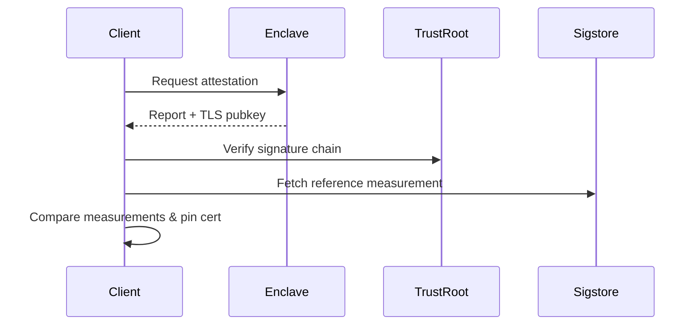

# Tinfoil Verifier

Portable remote-attestation verifier & secure HTTP client for enclave-backed services.

[](https://github.com/tinfoilsh/verifier/actions)

## Overview
Tinfoil Verifier is a Go library that verifies the integrity of remote enclaves (AMD SEV-SNP & Intel TDX) and binds that verification to TLS connections. It also ships a drop-in secure `http.Client` that performs attestation transparently.

## Features
- 🔒 **Hardware-rooted remote attestation** for SEV-SNP & TDX  
- 📦 **Self-contained** with no external attestation service
- 🕸 **Secure HTTP client** with automatic certificate pinning  
- 🛡 **Sigstore integration** for reference measurements  
- 🧑‍💻 **WASM build** for browser/nodejs  

## Installation
```bash
go get github.com/tinfoilsh/verifier@latest
```

> **Note**  Until `go-sev-guest` upstreams a required feature, add the temporary replace directive:
> ```bash
> go mod edit -replace github.com/google/go-sev-guest=github.com/tinfoilsh/go-sev-guest@v0.0.0-20250704193550-c725e6216008
> ```

## Quick Start
```go
import "github.com/tinfoilsh/verifier/client"

// 1. Create a client
tinfoilClient, err := client.NewDefaultClient()

// 2. Perform HTTP requests – attestation happens automatically
resp, err := tinfoilClient.Get("/api/data", nil)
```

To verify manually and expose the verification state:
```go
state, err := tinfoilClient.Verify() // ↳ returns *client.State with details
```

## Secure HTTP Client
The `client` package wraps `net/http` and adds:
1. **Attestation gate** – the first request verifies the enclave.
2. **TLS pinning** – the enclave-generated certificate fingerprint is pinned for the session.
3. **Round-tripping helpers** – convenience `Get`, `Post`, and generic `Do` methods.

```go
headers := map[string]string{"Content-Type": "application/json"}
body    := []byte(`{"key": "value"}`)

resp, err := cli.Post("/api/submit", headers, body)
```

For advanced usage retrieve the underlying `*http.Client`:
```go
httpClient, err := tinfoilClient.HTTPClient()
```

## Remote Attestation
Tinfoil Verifier currently supports two platforms:

| Platform       | Technique                                | Docs                                                  |
|----------------|------------------------------------------|-------------------------------------------------------|
| **AMD SEV-SNP**| VCEK certificates & SNP report validation | [AMD Spec](https://www.amd.com/en/developer/sev.html)  |
| **Intel TDX** | TDX quote validation & TD report checks   | [Intel Guide](https://www.intel.com/content/www/us/en/developer/tools/trust-domain-extensions/overview.html) |

### Verification Flow



## JavaScript / WASM

This verifier can be compiled to WebAssembly to run directly in web browsers. Built from the same Go source code, it's compiled to WebAssembly to run natively in browsers without requiring server-side verification.

When new versions are tagged, our GitHub Actions workflow automatically:
1. Compiles the Go verification logic to WebAssembly
2. Generates versioned WASM files with integrity guarantees
3. Deploys them to GitHub Pages for secure, cached distribution
4. Updates version tags so clients always load the correct module

This ensures that browser-based applications can perform an audit of Tinfoil without additional infrastructure dependencies.

**Usage**: This WASM verifier is integrated into [Tinfoil Chat](https://chat.tinfoil.sh) to provide transparent verification of the Tinfoil private chat. 

### Quick Start

Include required scripts:

```html
<script src="wasm_exec.js"></script>
<script src="main.js"></script>

<!-- Load and use the verifier -->
<script>
// Dynamically fetch the current version and load the corresponding WASM file
fetch("tinfoil-verifier.tag")
  .then(response => response.text())
  .then(version => {
    const go = new Go(); // Create verifier instance
    WebAssembly.instantiateStreaming(fetch(`tinfoil-verifier-${version}.wasm`), go.importObject)
      .then((result) => {
        go.run(result.instance);

        // Complete end-to-end verification (recommended)
        verify("inference.example.com", "tinfoilsh/confidential-llama-qwen")
          .then(groundTruthJSON => {
            const groundTruth = JSON.parse(groundTruthJSON);
            console.log("TLS Public Key:", groundTruth.tls_public_key);
            console.log("HPKE Public Key:", groundTruth.hpke_public_key);
            console.log("Verification successful!");
          })
          .catch(error => {
            console.error("Verification failed:", error);
          });
      });
  });
</script>
```

### Complete Verification (Recommended)

Use the `verify()` function for complete end-to-end verification that performs all steps atomically:

```javascript
// Complete end-to-end verification
const groundTruthJSON = await verify("inference.example.com", "tinfoilsh/confidential-llama-qwen");
const groundTruth = JSON.parse(groundTruthJSON);

// The ground truth contains:
// - tls_public_key: TLS certificate fingerprint
// - hpke_public_key: HPKE public key for E2E encryption
// - digest: GitHub release digest
// - code_measurement: Expected code measurement from GitHub
// - enclave_measurement: Actual runtime measurement from enclave
// - hardware_measurement: TDX platform measurements (if applicable)
// - code_fingerprint: Fingerprint of code measurement
// - enclave_fingerprint: Fingerprint of enclave measurement

console.log("TLS Public Key:", groundTruth.tls_public_key);
console.log("HPKE Public Key:", groundTruth.hpke_public_key);
console.log("Verification successful - measurements match!");
```

The `verify()` function automatically:
1. Fetches the latest release digest from GitHub
2. Verifies code provenance using Sigstore/Rekor
3. Performs runtime attestation against the enclave
4. Verifies hardware measurements (for TDX platforms)
5. Compares code and runtime measurements using platform-specific logic

If any step fails, an error is thrown with details about which step failed.

### Manual Step-by-Step Verification

For more control, you can perform individual verification steps:

```javascript
// 1. Verify enclave attestation
const enclaveResult = await verifyEnclave("inference.example.com");
console.log("Enclave measurement:", enclaveResult.measurement);

// 2. Verify code matches GitHub release
const repo = "org/repo";
const codeResult = await verifyCode(repo, expectedDigest);
console.log("Code measurement:", codeResult);

// 3. Compare measurements manually
if (enclaveResult.measurement === codeResult) {
  console.log("Verification successful!");
} else {
  console.error("Measurements don't match!");
}
```

## Auditing Guide
1. **Certificate chain** – see [`/attestation/genoa_cert_chain.pem`](attestation/genoa_cert_chain.pem)
2. **Attestation logic** – start with [`/attestation/attestation.go`](attestation/attestation.go) and platform files:
   - [`/attestation/sev.go`](attestation/sev.go)
   - [`/attestation/tdx.go`](attestation/tdx.go)
3. **Measurement matching** – inspect [`/sigstore/sigstore.go`](sigstore/sigstore.go)

## Reporting Vulnerabilities

Please report security vulnerabilities by emailing [contact@tinfoil.sh](mailto:contact@tinfoil.sh)

We aim to respond to security reports within 24 hours and will keep you updated on our progress.
